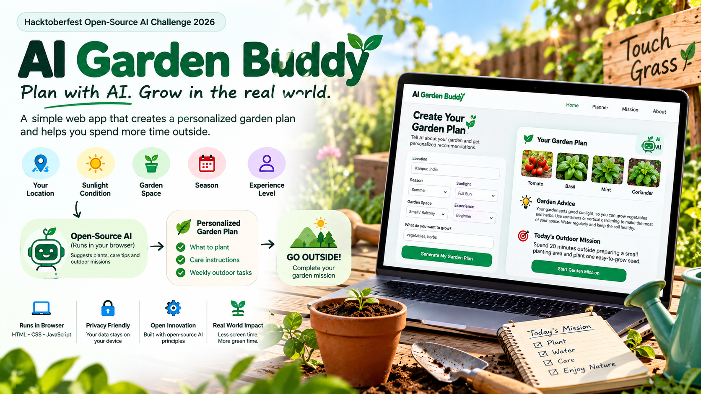
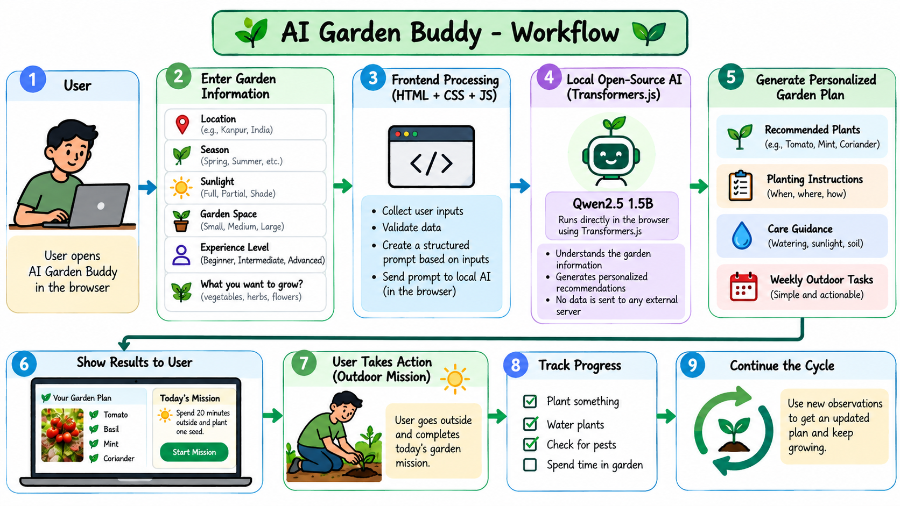

# AI Garden Buddy

### Plan with AI. Grow in the real world.

AI Garden Buddy is a simple, student-friendly web application created for the **Hacktoberfest Open-Source AI Challenge 2026 — Week 1: Touch Grass**.

The idea is simple: use AI to create a personalized gardening plan and then encourage the user to leave the screen and complete a real-world outdoor gardening mission.



---

## What I Built

**AI Garden Buddy** helps users create a personalized garden plan based on information such as:

- Location
- Season
- Sunlight
- Garden space
- Gardening experience
- What they want to grow

The application generates plant recommendations, gardening advice, and an outdoor mission.

The goal is not to keep users on the screen.

The goal is to make the screen the shortest part of the experience.

> **Plan with AI. Grow in the real world.**

---

## Why I Built This

A lot of AI applications are designed to keep us interacting with a screen.

For this challenge, I wanted to build something different.

AI Garden Buddy uses AI as a starting point and then encourages the user to do something in the physical world.

Instead of:

```text
AI → More Screen Time
```

the idea is:

```text
AI → Garden Plan → Go Outside → Take Action
```

---

## How It Works

The user first provides information about their garden.

```text
User
   |
   v
Garden Information
   |
   +--> Location
   +--> Season
   +--> Sunlight
   +--> Garden Space
   +--> Experience
   +--> What to Grow
   |
   v
AI Garden Planner
   |
   v
Personalized Garden Plan
   |
   +--> Recommended Plants
   +--> Garden Advice
   +--> Planting Instructions
   +--> Outdoor Mission
   |
   v
GO OUTSIDE
```

---

## Project Workflow

Here is the complete workflow of AI Garden Buddy:



The workflow starts with the user's garden information and ends with a real-world outdoor activity.

---

## Main Features

### Personalized Garden Planning

Users can provide their:

- Location
- Season
- Sunlight conditions
- Garden size
- Experience level
- Gardening interests

The application uses these inputs to create relevant recommendations.

### Plant Recommendations

The application recommends plants based on the selected season and sunlight conditions.

Examples include:

- Tomato
- Basil
- Mint
- Coriander
- Spinach
- Carrot
- Radish
- Peas
- Chili
- Okra

### Garden Advice

The application provides simple advice based on the user's garden conditions.

For example:

- Full sunlight → plants that prefer direct sunlight
- Partial sunlight → herbs and leafy vegetables
- Small space → containers and vertical gardening
- Beginner → start with easy-to-grow plants

### Outdoor Mission

The most important feature is the outdoor mission.

After generating a plan, the user receives a simple task such as:

> Spend 20 minutes outside preparing your garden and planting something new.

The idea is to close the laptop, put the phone away, and go outside.

### Local Storage

The application can save the generated garden plan in the browser using `localStorage`.

This allows the user to return to their plan without needing a database.

---

## Technology Used

The project is intentionally simple.

```text
HTML
CSS
JavaScript
```

There is no traditional backend.

### Frontend

- HTML5
- CSS3
- JavaScript
- Responsive design
- Browser Local Storage

### AI Direction

The project is designed around **open-source/open-weight AI running in the browser**, with **Transformers.js** as the browser inference layer and an open-weight model such as **Qwen2.5 1.5B** as the model option.

This approach allows the project to move toward local browser-based inference without requiring a traditional AI API backend.

---

## Project Structure

```text
AI-Garden-Buddy/
│
├── index.html
├── style.css
├── script.js
├── README.md
│
└── images/
    ├── ai-garden-buddy-banner.png
    └── ai-garden-buddy-workflow.png
```

---

## Why Open Innovation Matters

Open innovation is important for this project because it gives developers more control over how AI is used.

A browser-based open AI approach can provide several advantages.

### Privacy

Garden information can potentially remain on the user's device instead of being sent to a third-party AI service.

### Flexibility

Open-weight models can be replaced, experimented with, optimized, or fine-tuned depending on the project requirements.

### Learning

Using open AI technologies makes it easier to understand how the AI system works instead of treating an AI API as a black box.

### Lower Infrastructure Requirements

A browser-first architecture can reduce the need for a dedicated backend and AI server for simple use cases.

### Open Development

The project can be inspected, modified, improved, and extended by other developers.

---

## Why "Touch Grass"?

This project was created around the idea behind the **Touch Grass** challenge.

The application intentionally has a different goal from many other AI applications.

The user should not spend more time inside the application.

The application should help the user decide what to do and then encourage them to go outside.

```text
        AI
         |
         v
   Garden Plan
         |
         v
   Outdoor Mission
         |
         v
      🌱
   GO OUTSIDE
         |
         v
   Real-world action
```

---

## Example User Journey

### Step 1

The user opens AI Garden Buddy.

### Step 2

They enter:

```text
Location: Kanpur, India
Season: Summer
Sunlight: Full Sun
Garden Space: Small / Balcony
Experience: Beginner
Interest: Vegetables and herbs
```

### Step 3

The application creates a personalized garden plan.

### Step 4

The user receives plant recommendations and basic gardening advice.

### Step 5

The application provides an outdoor mission.

```text
Today's Mission

Spend 20 minutes outside.

Prepare a small planting area
and plant one easy-to-grow seed.
```

### Step 6

The user leaves the screen and completes the task.

That's the main purpose of the project.

---

## What I Learned

While building this project, I focused on keeping the architecture simple and making the AI useful for something outside the screen.

Some of the key things I explored were:

- Building a responsive frontend with HTML and CSS
- Creating interactive JavaScript workflows
- Using browser storage
- Designing AI-assisted user experiences
- Exploring browser-based open-weight AI
- Thinking about privacy and local inference
- Designing AI applications around real-world actions

---

## Future Improvements

There are several things I would like to add in future versions.

- Browser-based open-weight model inference
- More accurate location-based recommendations
- Local weather information
- Frost-date support
- Plant disease identification
- Garden progress tracking
- Plant watering reminders
- More plant varieties
- Offline support
- PWA support
- Voice-based garden assistant
- Garden journal
- Photo-based plant identification

---

## Screenshots

### Garden Planner

Add your application screenshot here:

```text
images/garden-planner.png
```

Example Markdown:

```markdown

```

### Outdoor Mission

Add your outdoor mission screenshot here:

```text
images/outdoor-mission.png
```

Example:

```markdown

```

---

## Running the Project

No backend installation is required for the current frontend version.

Clone the repository:

```bash
git clone https://github.com/YOUR-USERNAME/AI-Garden-Buddy.git
```

Go into the project:

```bash
cd AI-Garden-Buddy
```

Then open:

```text
index.html
```

in your browser.

You can also deploy the project using **GitHub Pages**.

---

## GitHub Pages

The project is suitable for GitHub Pages because it uses a frontend-only architecture.

```text
GitHub Repository
       |
       v
   GitHub Pages
       |
       v
    Browser
       |
       v
AI Garden Buddy
```

---

## Hacktoberfest

This project was created for:

**Hacktoberfest Open-Source AI Challenge — Week 1: Touch Grass**

The challenge focuses on building something with open-source AI that helps people spend more time in the real world.

AI Garden Buddy follows that idea by turning AI-generated recommendations into practical outdoor gardening activities.

---

## Contributing

Contributions are welcome.

You can contribute by:

- Adding new plants
- Improving the recommendation logic
- Improving the UI
- Adding accessibility improvements
- Adding new gardening missions
- Improving browser-based AI integration
- Adding offline capabilities
- Improving documentation

Fork the repository, make your changes, and submit a pull request.

---

## License

This project is open source and available under the MIT License.

---

## Final Thought

Technology does not always need to keep us behind a screen.

Sometimes the best thing AI can do is give us a reason to close the screen and step outside.

**AI Garden Buddy**

> **Plan with AI. Grow in the real world.**

---

Built with HTML, CSS, JavaScript and open-source AI ideas for the Hacktoberfest Open-Source AI Challenge 2026.